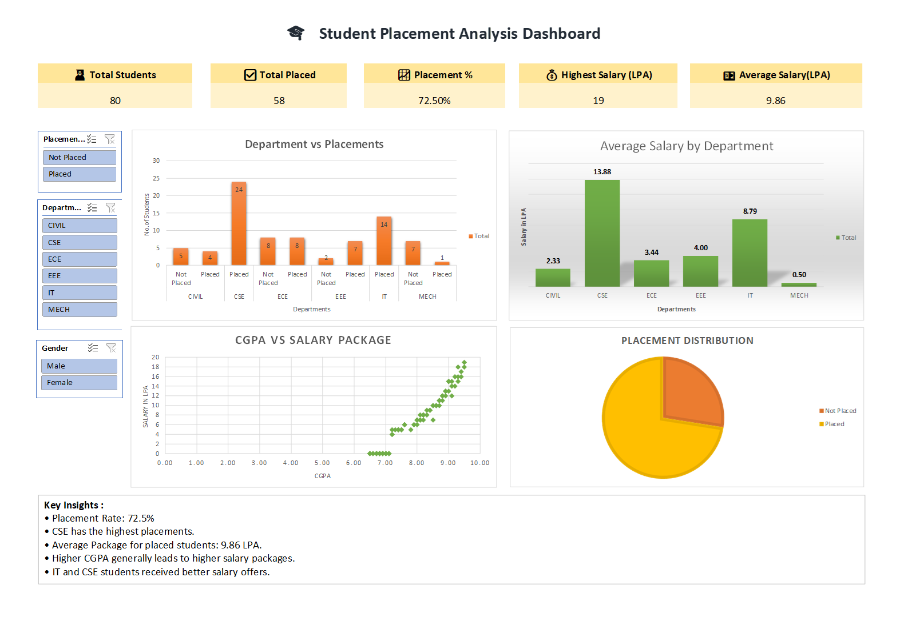

\# Student Placement Analysis

\## Project Overview

This project analyzes student placement data using:

\- Excel Dashboard

\- SQL Analysis

\- Python EDA

\- Machine Learning

\## Tools Used

\- Excel

\- SQL

\- Python

\- Pandas

\- Matplotlib

\- Scikit-Learn

\## Key Insights

\- Placement Rate: 72.5%

\- Average Package: 9.86 LPA

\- CSE has the highest placements

\- Higher CGPA leads to higher salary packages

\## Machine Learning

Model Used:

\- Logistic Regression

Accuracy:

\- 93.75%

\## Project Workflow

Data Collection

↓

Excel Dashboard

↓

SQL Analysis

↓

Python EDA

↓

Machine Learning

## Dashboard Preview

